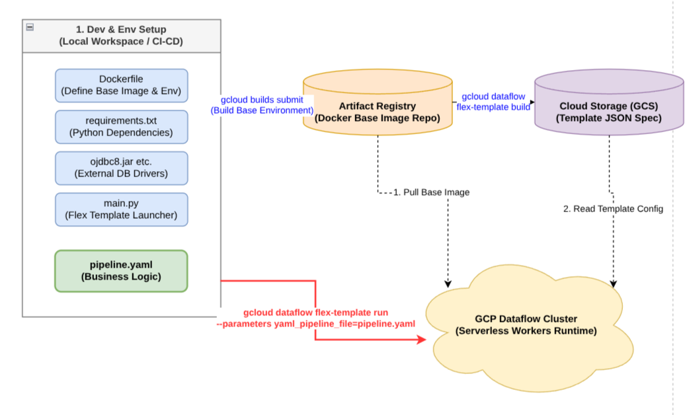

# 深度解析：Apache Beam YAML 部署至 GCP Dataflow 的架构与最佳实践

Apache Beam YAML 是当下构建声明式（Declarative）数据流水线的新宠。它将开发人员从繁琐的代码逻辑中解放出来，使得构建 ETL 变得像写配置文件一样优雅。对于依托 Google Cloud Platform (GCP) Dataflow 作为流/批处理核心架构的团队（例如我们 RCDP 平台）而言，如何优雅、稳定且可控地将 YAML 部署上线，是一个极具挑战性的架构问题。

本文将从底层架构视角出发，深度拆解 Beam YAML 在 GCP Dataflow 上的部署方案，并深入探讨依赖管理、Flex Template 套娃架构以及与传统 Java 部署体系的核心差异。

---

## 1. 核心挑战：YAML 只有逻辑，没有环境

Beam YAML 的设计初衷是“专注业务逻辑”，它本身并不具备“管理底层环境依赖”的能力。当 Dataflow 解析 `pipeline.yaml` 文件时，它会将声明的节点（Transforms）翻译成底层的 Java 或 Python 代码。

这带来了一个致命痛点：**如果您的 YAML 中使用了非 GCP 内置的组件，运行就会崩溃。**
*   **跨语言依赖 (Java/JDBC)**：只要在 YAML 里使用了 `ReadFromJdbc` (例如连接 Oracle 或 MySQL)，底层就需要对应的 JDBC Jar 包驱动。
*   **特定的 Python 依赖**：如果您在 `MapToFields` 节点里嵌入了 Python 代码并 `import` 了诸如 `nltk` 或 `pandas` 等第三方库，您的运行环境必须提前装好这些库。

Beam YAML 解析器在运行时**不会**自动去 Maven 仓库或 PyPI 为您临时下载依赖。因此，所有的依赖准备工作，必须前置到 **Docker 镜像** 中完成。

---

## 2. 架构基石：Flex Template 的“套娃”艺术

要解决上述环境依赖问题，我们必须引入 GCP Dataflow 的高级部署机制：**Flex Template**。


*图 1：Beam YAML 结合 Flex Template 的环境解耦与执行架构。左侧展示了本地开发打包环节，通过 Artifact Registry 的底层镜像与 GCS 的模板配置，实现了将静态运行环境与动态 YAML 逻辑完美分离的“套娃”打法。*

Flex Template 的本质是：**一个 Docker Image (肉身) + 一个 JSON 说明书 (入口)。**

当您将 Beam YAML 与 Flex Template 结合时，您实际上创造了一个“万能播放器”与“光盘”的解耦架构：
1.  **大底座 (Docker Image)**：提前打包好所有可能用到的 Python 包、JDBC Jar 包以及 Beam YAML 解析引擎。
2.  **入口描述 (JSON 模板)**：存在 GCS 上，告诉 Dataflow 镜像在哪。
3.  **业务逻辑 (YAML 文件)**：存在 GCS 上，作为参数在运行时动态传给镜像。

只要底座够扎实，未来增加几十条不同的 ETL 流水线，都只需要上传新的 YAML 文件，**实现真正的零构建、秒级发布**。

---

## 3. 部署实战：两种核心打法

### 方案 A：“终极偷懒版” (适合纯 GCP 内部流转)

如果您只是在 GCP 全家桶（BigQuery, Pub/Sub, GCS）内搬运数据，不需要任何第三方依赖，直接使用 GCP 封装好的快捷命令即可：

```bash
gcloud dataflow yaml run rcdp-etl-job-001 \
  --yaml-pipeline-file=pipeline.yaml \
  --region=asia-east1
```
**幕后黑箱揭秘**：此命令并未在本地编译任何 Docker 镜像。它自动将 YAML 上传至临时 GCS，并调用 GCP 官方维护的公共 Dataflow YAML Flex Template（预装了所有原生 Connector），瞬间拉起计算集群。效率极高，但扩展性受限。

### 方案 B：“企业级定制版” (适合带有 Oracle 等复杂依赖的架构)

对于企业级数据中台（如 RCDP），我们需要构建包含各类数据库驱动的“万能大底座”。步骤如下：

**Step 1: 准备依赖与启动器**
准备 `requirements.txt` 和一个极简的启动器 `main.py` 将控制权交给 YAML 引擎：
```python
import logging
from apache_beam.yaml import main
if __name__ == '__main__':
    logging.getLogger().setLevel(logging.INFO)
    main.run()
```

**Step 2: 编写 Dockerfile (核心)**
我们需要基于官方 Python 模板底座，安装 Python 包并手动注入所需的 Java Jar 包：
```dockerfile
FROM gcr.io/dataflow-templates-base/python310-template-launcher-base

# 1. 业务需要的 Python 依赖
COPY requirements.txt /template/
RUN pip install -r /template/requirements.txt

# 2. 注入第三方 Java 驱动 (以 Oracle 为例)
COPY ojdbc8.jar /opt/oracle/ojdbc8.jar
ENV CLASSPATH="/opt/oracle/ojdbc8.jar:${CLASSPATH}"

# 3. 设置 Flex Template 入口
ENV FLEX_TEMPLATE_PYTHON_PY_FILE="/template/main.py"
WORKDIR /template
COPY main.py pipeline.yaml /template/
```

**Step 3: 推送镜像并生成 JSON 模板**
```bash
# 推送 Docker 镜像到 Artifact Registry
gcloud builds submit --tag asia-east1-docker.pkg.dev/my-project/repo/beam-yaml-template:latest

# 生成 GCS 上的 JSON 模板说明书
gcloud dataflow flex-template build gs://my-bucket/templates/beam-yaml-template.json \
  --image asia-east1-docker.pkg.dev/my-project/repo/beam-yaml-template:latest \
  --sdk-language "PYTHON"
```

**Step 4: 动态指定 YAML 启动任务**
使用 JSON 模板启动，并将 GCS 上的业务 YAML 路径作为参数透传，实现彻底的逻辑与环境解耦：
```bash
gcloud dataflow flex-template run "beam-yaml-job-run1" \
  --template-file-gcs-location gs://my-bucket/templates/beam-yaml-template.json \
  --parameters yaml_pipeline_file="gs://my-bucket/configs/job1.yaml"
```

---

## 4. 架构反思：Java 与 Python/YAML 的底层差异

为什么传统 Java 开发者部署 Beam 感觉不到 Docker 的存在，而 Python 和 YAML 却与 Docker 深度绑定？

*   **Java 的 “Uber Jar (胖包)”**：Java 生态可以利用 Maven 打出一个包含所有依赖库（包括 Oracle JDBC 等）的超级大 Jar 包。GCP 只需要拉起一个纯净的 JRE 虚拟机，执行 `java -jar` 即可。JVM 的高度标准化让其免去了复杂的环境封装。
*   **Python 的系统级依赖**：Python 生态不仅依赖 `pip`，底层通常还交织着 C 语言编译的动态链接库（.so）和系统级环境。加之 Beam YAML 大量依赖跨语言（Java）Connector，这种复杂的混合环境只有靠 Docker 镜像才能被 100% 确定性地封印和还原。

不过，殊途同归。鉴于传统 Uber Jar 每次启动上传速度慢，如今 GCP 也强烈建议将 Java Beam 同样打包进 Flex Template (Docker) 中，以获得秒级的容器化启动体验和更强的扩展能力。

---

**总结**：Beam YAML 是数据分析师的神器，但其背后支撑起这一切的，是数据平台架构师通过 Flex Template 精心构建的、包含了无数复杂依赖的强大基础镜像体系。理解了这一层“套娃”关系，您才能在云端的大数据洪流中游刃有余。